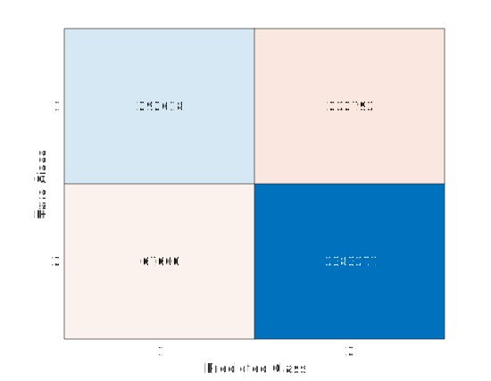

<!-- # Neuromorphic Engineering Project
All the code for my master degree at ICNS -->

# Classification with FEAST network:

This analysis aims to demonstrate how the network works on various conditions and present the associated results.

## 1st recording condition:

**Original video: Circles and lines (Separated)**

In this recording, the same number of circles and lines were included on the e-paper display with some background events and real-world noise. In this case, the circles and lines are separated to test the algorithm on the most basic recording setup.

  

**Labelled data**

Class label 1         |  Class label 0 - Everything else |
:-------------------------:|:-------------------------:|
 |  |

### Network Structure: 

16F11x11-RF3x3 network (equivalent to a 16x16 feast neurons with 11x11 context using a 3x3 receptive field for spatial pooling with linear classifier)

**Final Results**

Red events belong to circle and black events belong to all other events

  

In this example, the network predicted circle events with 89.49% accuracy with very few false positive as shown on the left side of the recording, where few events on the edges of the left rectangle were falsely predicted as circles. The reason behind the few misclassified events might be from the labelled data where some edges of the rectangle were labelled with the circle.

Value associated with each evaluation metrix.

<table><thead><tr><th rowspan="2"></th><th colspan="2" rowspan="2">Accuracy</th><th colspan="2">Sensitivity</th><th colspan="2">Specificity</th><th colspan="2">Informedness</th></tr><tr><td>Class 1</td><td>Class 0</td><td>Class 1</td><td>Class 0</td><td>Class 1</td><td>Class 0</td></tr></thead><tbody><tr><td>Linear Classifier</td><td colspan="2">89.49</td><td>0.6305</td><td>0.9590</td><td>0.9590</td><td>0.6305</td><td>0.5895</td><td>0.5895</td></tr></tbody></table>

  

**Top:** A bar plot that shows the weight value for each neurons. **Bottom** an image chart shows the associated features for each neuron through time.

  

Non-normalized confusion matrix.

## 2nd recording condition:

**Original video: Circles overlapping with each other**

In this recording, the circles were overlapped with each other to increase the complexity and to include more features like edges between circles, narrow/widder lines. The aim is to test the algorithm performance on overlaped circles that look like number 8.

  

**Labelled data**

Class label 1         |  Class label 0 - Everything else |
:-------------------------:|:-------------------------:|
 |  |

### Network Structure: 

16F11x11-RF3x3 network (equivalent to a 16x16 feast neurons with 11x11 context using a 3x3 receptive field for spatial pooling with linear classifier)

**Final Results: One weight for all classes**

In this case, all the events were fed to FEAST network to extract all possible features for both classes. At the end of the training, there was one trained weight that is used at inference.

  

Values associated with each evaluation metrix.

<table><thead><tr><th rowspan="2"></th><th colspan="2" rowspan="2">Accuracy</th><th colspan="2">Sensitivity</th><th colspan="2">Specificity</th><th colspan="2">Informedness</th></tr><tr><td>Class 1</td><td>Class 0</td><td>Class 1</td><td>Class 0</td><td>Class 1</td><td>Class 0</td></tr></thead><tbody><tr><td>Linear Classifier</td><td colspan="2">75.61</td><td>0.5390</td><td>0.8720</td><td>0.8720</td><td>0.5390</td><td>0.4110</td><td>0.4110</td></tr></tbody></table>

  

**Top:** A bar plot that shows the weight value for each neurons. **Bottom** an image chart shows the associated features for each neuron through time.

  

Non-normalized confusion matrix.

**Final Results: Different weight for each class**

In this case, the labelled events were used in FEAST network to extract features from each class separately. At the end, there will be a dedicated trained weight with specific features belong to each class. The aim was to test the algorithm when the weight are more regulated and constrained. 
The results show that using a dedicated weight for each class can increase the accuracy to <90% and produce less false positive events. As can be seen, the events for circle and overlapped circles were properly detected.

  

Values associated with each evaluation metrix.

<table><thead><tr><th rowspan="2"></th><th colspan="2" rowspan="2">Accuracy</th><th colspan="2">Sensitivity</th><th colspan="2">Specificity</th><th colspan="2">Informedness</th></tr><tr><td>Class 1</td><td>Class 0</td><td>Class 1</td><td>Class 0</td><td>Class 1</td><td>Class 0</td></tr></thead><tbody><tr><td>Linear Classifier</td><td colspan="2">90.21</td><td>0.5677</td><td>0.9724</td><td>0.9724</td><td>0.5677</td><td>0.5402</td><td>0.5402</td></tr></tbody></table>

  

**Top:** A bar plot that shows the weight value for each neurons. **Bottom** an image chart shows the associated features for each neuron through time.

  

Non-normalized confusion matrix.

## 3rd recording condition:

**Original video: Circles between other geometrical shapes**

In order to test the algorithm performance, new objects were added in the visual field such as rectangles and squares. In this case, features from the triangles might look similar to the ones from the squares. This makes the learning more challenging because it will not only learn the circle feature but also all possible edges from other objects.

  

**Labelled data**

Class label 1         |  Class label 0 - Everything else |
:-------------------------:|:-------------------------:|
 |  |

### Network Structure: 

16F11x11-RF3x3 network (equivalent to a 16x16 feast neurons with 11x11 context using a 3x3 receptive field for spatial pooling with linear classifier)

**Final Results: One weight for all classes**

The results show that with this recording setup, the algorithm performance achieves 69.90% using a linear classifier. Few events were falsely classified as circles as seen on the edges of the square and triangle. 

  

Values associated with each evaluation metrix.

<table><thead><tr><th rowspan="2"></th><th colspan="2" rowspan="2">Accuracy</th><th colspan="2">Sensitivity</th><th colspan="2">Specificity</th><th colspan="2">Informedness</th></tr><tr><td>Class 1</td><td>Class 0</td><td>Class 1</td><td>Class 0</td><td>Class 1</td><td>Class 0</td></tr></thead><tbody><tr><td>Linear Classifier</td><td colspan="2">69.90</td><td>0.6167</td><td>0.7630</td><td>0.7630</td><td>0.6167</td><td>0.3797</td><td>0.3797</td></tr></tbody></table>

  

**Top:** A bar plot that shows the weight value for each neurons. **Bottom** an image chart shows the associated features for each neuron through time.

  

Non-normalized confusion matrix.

**Final results: Dedicated weight for each class with larger ROI**

In this example, FEAST was applied to each class individually to construct a separate weight for each class. A larger ROI was also selected. Results show that the algorithm accuracy increased but the false-positive increased too. As can be seen, the sensitivity for the circle was as low as 0.25% comparing it with the other class, which was 0.9536. Overall, with this algorithm setup (larger ROI and weight allocation for each class) the algorithm poorly detected the events that belonged to circles.

  

Values associated with each evaluation metrix.

<table><thead><tr><th rowspan="2"></th><th colspan="2" rowspan="2">Accuracy</th><th colspan="2">Sensitivity</th><th colspan="2">Specificity</th><th colspan="2">Informedness</th></tr><tr><td>Class 1</td><td>Class 0</td><td>Class 1</td><td>Class 0</td><td>Class 1</td><td>Class 0</td></tr></thead><tbody><tr><td>Linear Classifier</td><td colspan="2">80.12</td><td>0.2567</td><td>0.9536</td><td>0.9536</td><td>0.2567</td><td>0.2103</td><td>0.2103</td></tr></tbody></table>

  

**Top:** A bar plot that shows the weight value for each neurons. **Bottom** an image chart shows the associated features for each neuron through time.

  

Non-normalized confusion matrix.

## 4th recording condition:

**Original video: Circles overlapping with other class**

In this recording, the circles were placed on the top of the lines. The aim of this experiment is to test the algorithm under different overlap condition.

  

**Labelled data**

Class label 1         |  Class label 0 - Everything else |
:-------------------------:|:-------------------------:|
 |  |

### Network Structure: 

16F11x11-RF3x3 network (equivalent to a 16x16 feast neurons with 11x11 context using a 3x3 receptive field for spatial pooling with linear classifier)

**Final Results**

The algorithm achieved 81.63% in overall accuracy on both classes. However, with lower sensitivity for circles event and higher sensitivity for line classes. That indicates that the network produced a few false-positive and miss-classified events due to the complex features generated by the overlap patterns between both of the classes.

  

Values associated with each evaluation metrix.

<table><thead><tr><th rowspan="2"></th><th colspan="2" rowspan="2">Accuracy</th><th colspan="2">Sensitivity</th><th colspan="2">Specificity</th><th colspan="2">Informedness</th></tr><tr><td>Class 1</td><td>Class 0</td><td>Class 1</td><td>Class 0</td><td>Class 1</td><td>Class 0</td></tr></thead><tbody><tr><td>Linear Classifier</td><td colspan="2">81.63</td><td>0.4602</td><td>0.9313</td><td>0.9313</td><td>0.4602</td><td>0.3915</td><td>0.3915</td></tr></tbody></table>

  

**Top:** A bar plot that shows the weight value for each neurons. **Bottom** an image chart shows the associated features for each neuron through time.

  

Non-normalized confusion matrix.

## 5th recording condition:

**Original video: Shaking the camera in front of a lemon tree**

In this example, the colourDAVIS346 was used in an open real-world scene. We shook the camera in front of a lemon tree with two visible lemons in the visual field to generate events. The motion was uneven because the camera was hand-held. 

  

**Labelled data**

Class label 1        |  Class label 0 - Everything else |
:-------------------------:|:-------------------------:|
 |  |

### Network Structure: 

16F11x11-RF3x3 network (equivalent to a 16x16 feast neurons with 11x11 context using a 3x3 receptive field for spatial pooling with linear classifier)

**Final Results**

Using a similar network configuration used in previous data, the algorithm achieved 94.09% in overall accuracy but with low sensitivity for the lemon class. The output of the network which the predicted events for lemon show a weird square shape which looks like a bounding box around the object. That can be due to acquiring APS data which affect the behaviour of events or by the uneven and random motion of the camera, which generate lots of cluttered events. 

  

Values associated with each evaluation metrix.

<table><thead><tr><th rowspan="2"></th><th colspan="2" rowspan="2">Accuracy</th><th colspan="2">Sensitivity</th><th colspan="2">Specificity</th><th colspan="2">Informedness</th></tr><tr><td>Class 1</td><td>Class 0</td><td>Class 1</td><td>Class 0</td><td>Class 1</td><td>Class 0</td></tr></thead><tbody><tr><td>Linear Classifier</td><td colspan="2">94.09</td><td>0.1272</td><td>0.9984</td><td>0.9984</td><td>0.1272</td><td>0.1256</td><td>0.1256</td></tr></tbody></table>

  

**Top:** A bar plot that shows the weight value for each neurons. **Bottom** an image chart shows the associated features for each neuron through time.

  

Non-normalized confusion matrix.

## 6th recording condition:

**Original video: Slidding the camera through the lemon tree**

In this example, the colourDAVIS camera was slidded through the lemon tree in an open field at HIE. Each tree contains a certain number of lemons which are either hagging or overlapped with other lemon or leaves. The events were labelled based on how many lemons can be seen.

  

**Labelled data**

Class label 1        |  Class label 0 - Everything else |
:-------------------------:|:-------------------------:|
 |  |

### Network Structure: 

16F11x11-RF3x3 network (equivalent to a 16x16 feast neurons with 11x11 context using a 3x3 receptive field for spatial pooling with linear classifier)

**Final Results**

The final results show that the network achieved accuracy as high as 96.36%, however, with very low sensitivity for the lemon class (0.0002) and a very high for the other class (0.9998). That is because the classes are significantly imbalanced and the features are very diverse which can contain the same curve in both classes, for example, using an 11x11 ROI the curve of leaves might look like a curve from a lemon. That lead to miss-classification of events and lots of false positive.

  

Values associated with each evaluation metrix.

<table><thead><tr><th rowspan="2"></th><th colspan="2" rowspan="2">Accuracy</th><th colspan="2">Sensitivity</th><th colspan="2">Specificity</th><th colspan="2">Informedness</th></tr><tr><td>Class 1</td><td>Class 0</td><td>Class 1</td><td>Class 0</td><td>Class 1</td><td>Class 0</td></tr></thead><tbody><tr><td>Linear Classifier</td><td colspan="2">96.36</td><td>0.0002</td><td>0.9998</td><td>0.9998</td><td>0.0002</td><td>0.3982</td><td>0.3982</td></tr></tbody></table>

  

**Top:** A bar plot that shows the weight value for each neurons. **Bottom** an image chart shows the associated features for each neuron through time.

  

Non-normalized confusion matrix.