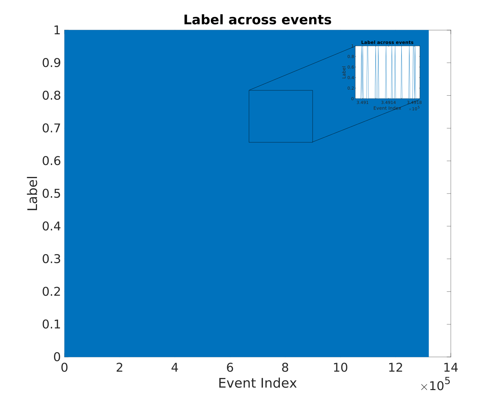
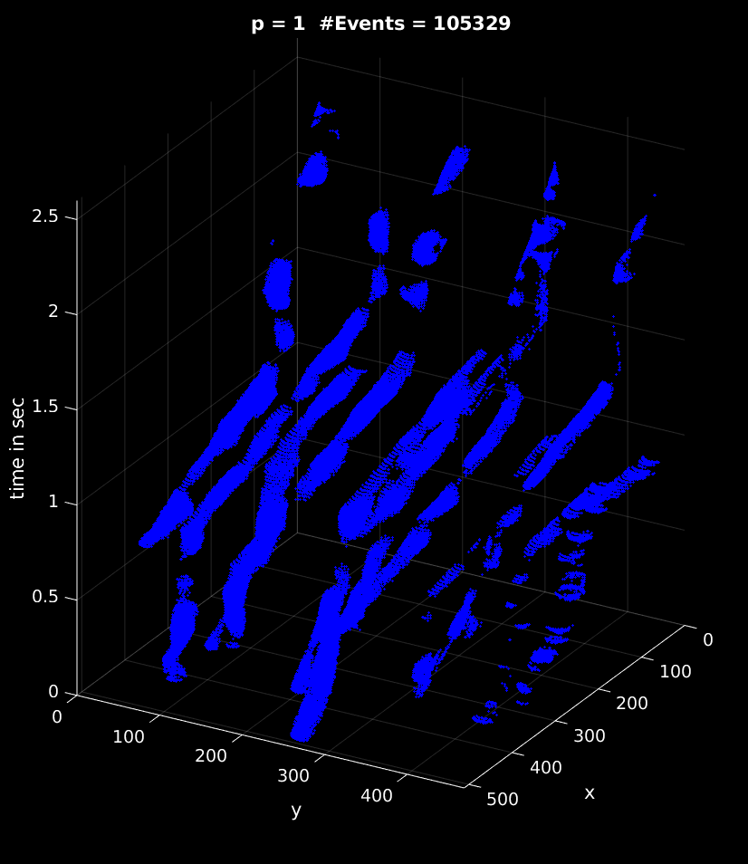

<!-- # Neuromorphic Engineering Project
All the code for my master degree at ICNS -->

## Content

- [Data Labelling](#data-labelling)
- [Input Events](#input-events)
- [Events after labelling](#events-after-labelling)
- [Events Interpolation](#events-interpolation)
- [Flattened features and labels](#flattened-features-and-labels)
- [Balance Ratio for features and labels](#balance-ratio-for-features-and-labels)
- [Classification Results](#classification-results)
  - [Unsupervised FE and supervised classification](#unsupervised-fe-and-supervised-classification)
  - [Supervised FE and supervised classification](#supervised-fe-and-supervised-classification)
- [Feature Extraction 16 Neurons](#feature-extraction-16-neurons)
- [Feature Map at inference](#feature-map-at-inference)
- [Feature Map for each class](#feature-map-for-each-class)
- [3x3 Neighboring pixels features](#3x3-neighboring-pixels-features)
- [Case 1: No Overlap](#case-1-no-overlap)
  - [Input Data](#input-data)
  - [Feature Map at Inference](#feature-map-at-inference-1)
  - [Events after labelling](#events-after-labelling-1)
  - [Events Interpolation](#events-interpolation-1)
  - [Additional Figures](#additional-figures)
  - [Classification Results](#classification-results-1)
    - [Unsupervised FEAST](#unsupervised-feast)
    - [Supervised FEAST](#supervised-feast)

# Data Labelling

  

# Input Events

  

# Events after labelling

Class label 1 - Circles          |  Class label 0 - Everything else |
:-------------------------:|:-------------------------:|
 |  |

# Events Interpolation

  

# Flattened features and labels

Labels across time          |  Flattened features |
:-------------------------:|:-------------------------:|
 |  |

# Balance Ratio for features and labels

|            | Class 0 | Class 1 | Balancing Ratio |
|:----------:|:-------:|:-------:|:-------:|
| Imbalanced |  972425 |  347374 |    1:3     |
|  Balanced  |  347374 |  347374 |    1:1     |

# Classification Results

## Unsupervised FE and supervised classification

|              | Balanced | Imbalanced |
|:------------:|:--------:|:----------:|
|  Sensitivity |     0.5459     |      0.9997     |
|  Specificity |     0.4755     |      0.0004     |
| Informedness |     0.0214     |      0.9131     |
|     RMSE     |     0.5143     |      0.4603     |
|   Accuracy   |     51.0735    |      73.6277    |

## Supervised FE and supervised classification

  

|              | Balanced | Imbalanced |
|:------------:|:--------:|:----------:|
|  Sensitivity |     0.7858     |      0.9257      |
|  Specificity |     0.8014     |      0.5409      |
| Informedness |     0.5872     |      0.4666      |
|     RMSE     |     0.4074     |      0.3815      |
|   Accuracy   |     79.3600    |      82.9367     |

# Feature Extraction 16 Neurons

  

# Feature Map at inference

For this feature map, we linearly looped (no shuffling) through events data one time.

Here the trained weight is used at inference without updating the threshold.

  

# Feature Map for each class

We splitted the feature maps for each class.

FM for class Circles          |  FM for other class |
:-------------------------:|:-------------------------:|
 |  |

# 3x3 Neighboring pixels features

Neighboring pixels for class circle          |  Neighboring pixels for other class |
:-------------------------:|:-------------------------:|
 |  |

# Case 1: No Overlap

## Input Data

  

## Feature Map at Inference

  

## Events after labelling

## Events Interpolation

## Additional Figures

## Classification Results

### Unsupervised FEAST

### Supervised FEAST

<!-- **Step 1:** Performance metric

We aim to evaluate the model over different evaluation metrics such the ones below, the reason for this is that the model may give satisfactory results if using accuracy as a metric, but may perform poorly when evaluated on other metrics, therefore, it is not enough to truly judge our model based on accuracy.

1. Specificity = TN/(TN+FP) which cover all true negatives, for instance, if we want to detect the correct fruit labels and we don't want the other features to be detected as fruits, then in this case false positives are intolarable.
2. Sensitivity (Recall) = TP/(TP+FN), for instance, out of labelled fruits (GT), how many were correctly predicted as fruits? Sensitivity is appropriate when minimizing the false negatives is the focus.
3. Informedness = Specificity + Sensitivity - 1, this measure is suitable for highly imbalanced data where the vast majority of the spatio-temporal event are labelled as false regions.
4. Precision (Positive prediction value) = TP/(TP+FP) which is the ratio of the correctly +ve labeled to all +ve labeled, for example, how many of those who we labeled as fruits are actually fruits? Precision is suited when minimizing the false positives is the focus.
5. F1-Score = 2*(Sensitivity * Precision) / (Sensitivity + Precision), consider both recall and precision, here F1 is considered as good when the there is a balance between precision and recall. 
6. Plot confusion matrix combining all these measures

**Step 2:** Regularization during training

It has been shown that adding noise during training can improve the robustness of the network resulting in better generalization and faster learning. This will be done by adding a noise vector onto each input pattern or a section of the input data before it is presented to the network. This will enforce the model to learn robust features in the presence of noise pattern added to the inputs. We will observe the performance change at each run. On the other hand, adding noise was a way to test the model performance in the worse case scenario to understand the model limitation.

We aim to experiment with different amounts and different type of noise in order to discover what works best. We also aim to understand which noise has major affect on the model as well as which noise can cause the model to fail.

1. Adding zeroes to the traning data
2. Adding random noise to the input data
3. Adding gaussian noise to the input data
4. Adding noise to activation function

**Step 3:** Cross validation ratio

Changing the ratio of training and test set

1. 80/20 ratio
2. 70/30 ratio
3. 60/40 ratio
4. 50/50 ratio

**Step 4:** Put results in a table

Proposed results table:

<table>
<tr>
<td colspan=1>    <td colspan=4>Standard  <td colspan=4>Zero Noise <td colspan=4>Random Noise <td colspan=4>Gaussian Noise <td colspan=4>Activation Function Noise
<tr>
<td colspan=1> <td colspan=1>80/20 <td colspan=1>70/30 <td colspan=1>60/40
<td colspan=1>50/50<td colspan=1>80/20 <labels.pngtd colspan=1>70/30 <td colspan=1>60/40
<td colspan=1>50/50<td colspan=1>80/20 <td colspan=1>70/30 <td colspan=1>60/40
<td colspan=1>50/50<td colspan=1>80/20 <td colspan=1>70/30 <td colspan=1>60/40
<td colspan=1>50/50
<tr>
<td rowspan=1>Sensitivity
<td colspan=1> <td colspan=1> <td colspan=1>
<td colspan=1>  <td colspan=1>   <td colspan=1>  <td colspan=1>
<td colspan=1>  <td colspan=1>   <td colspan=1>  <td colspan=1>
<td colspan=1>  <td colspan=1>   <td colspan=1>  <td colspan=1>
<td colspan=1>  <td colspan=1>   <td colspan=1>  <td colspan=1>
<td colspan=1> <tr>
<td rowspan=1>Specificity
<td colspan=1> <td colspan=1> <td colspan=1>
<td colspan=1>  <td colspan=1>   <td colspan=1>  <td colspan=1>
<td colspan=1>  <td colspan=1>   <td colspan=1>  <td colspan=1>
<td colspan=1>  <td colspan=1>   <td colspan=1>  <td colspan=1>
<td colspan=1>  <td colspan=1>   <td colspan=1>  <td colspan=1>
<td colspan=1> <tr>
<td rowspan=1>Informedness
<td colspan=1> <td colspan=1> <td colspan=1>
<td colspan=1>  <td colspan=1>   <td colspan=1>  <td colspan=1>
<td colspan=1>  <td colspan=1>   <td colspan=1>  <td colspan=1>
<td colspan=1>  <td colspan=1>   <td colspan=1>  <td colspan=1>
<td colspan=1>  <td colspan=1>   <td colspan=1>  <td colspan=1>
<td colspan=1> <tr>
<td rowspan=1>Precision
<td colspan=1> <td colspan=1> <td colspan=1>
<td colspan=1>  <td colspan=1>   <td colspan=1>  <td colspan=1>
<td colspan=1>  <td colspan=1>   <td colspan=1>  <td colspan=1>
<td colspan=1>  <td colspan=1>   <td colspan=1>  <td colspan=1>
<td colspan=1>  <td colspan=1>   <td colspan=1>  <td colspan=1>
<td colspan=1> <tr>
<td rowspan=1>F1-Score
<td colspan=1> <td colspan=1> <td colspan=1>
<td colspan=1>  <td colspan=1>   <td colspan=1>  <td colspan=1>
<td colspan=1>  <td colspan=1>   <td colspan=1>  <td colspan=1>
<td colspan=1>  <td colspan=1>   <td colspan=1>  <td colspan=1>
<td colspan=1>  <td colspan=1>   <td colspan=1>  <td colspan=1>
<td colspan=1> <tr>
</table>

# Feature Extraction and Classification Model

  

 -->

<!-- # Case 1: No Overlap

The 3D profile of the fruits labels

  

Labels Count for each class

  

Counting how many times each neuron was selected as a winner neurons

  

Distribution of Xtrain and Xtest

  

<table>
<tr>
<td colspan=1>    <td colspan=5>50/50  <td colspan=5>60/40 <td colspan=5>70/30 <td colspan=5>80/20
<tr>
<td colspan=1> <td colspan=1>0 <td colspan=1>50 <td colspan=1>100 <td colspan=1>150
<td colspan=1>200 <td colspan=1>0<td colspan=1>50 <td colspan=1>100 <td colspan=1>150
<td colspan=1>200<td colspan=1>0<td colspan=1>50 <td colspan=1>100 <td colspan=1>150
<td colspan=1>200<td colspan=1>0<td colspan=1>50 <td colspan=1>100 <td colspan=1>150
<td colspan=1>200
<tr>
<td rowspan=1>Sensitivity
<td colspan=1> 1 <td colspan=1> 0.98<td colspan=1>0.99
<td colspan=1> 0.9933 <td colspan=1> 0.995  <td colspan=1> 1 <td colspan=1>0.98
<td colspan=1> 0.99 <td colspan=1> 0.9933  <td colspan=1> 0.995 <td colspan=1> 1
<td colspan=1> 0.98 <td colspan=1> 0.99  <td colspan=1> 0.9933 <td colspan=1>0.995
<td colspan=1> 1  <td colspan=1> 0.98  <td colspan=1> 0.99 <td colspan=1>0.9933
<td colspan=1> 0.995 <tr>
<td rowspan=1>Specificity
<td colspan=1> 0 <td colspan=1> 0.0203<td colspan=1>0.0086
<td colspan=1> 0.0087 <td colspan=1>  0.0073 <td colspan=1> 0 <td colspan=1> 0.0227
<td colspan=1> 0.0096 <td colspan=1>  0.0058 <td colspan=1> 0.002 <td colspan=1> 0
<td colspan=1> 0.0149 <td colspan=1>  0.0099 <td colspan=1> 0.004 <td colspan=1>0.0027
<td colspan=1> 0 <td colspan=1> 0.0249  <td colspan=1> 0.0089 <td colspan=1>0.0106
<td colspan=1> 0.0083<tr>
<td rowspan=1>Informedness
<td colspan=1> -0.1568<td colspan=1> 0.2486<td colspan=1>-0.0014
<td colspan=1> 0.0021 <td colspan=1> 0.0022  <td colspan=1> -0.1681 <td colspan=1> 0.0027
<td colspan=1> -0.3753 <td colspan=1>  -0.9236 <td colspan=1>  -0.003<td colspan=1> -0.1866
<td colspan=1> -0.0052 <td colspan=1> -0.76  <td colspan=1> -0.0023 <td colspan=1>-0.0023
<td colspan=1>-0.1121 <td colspan=1>  0.0049 <td colspan=1>-0.0012 <td colspan=1>0.0039

<td colspan=1>0.0033<tr>
<td rowspan=1>Accuracy
<td colspan=1> 99.7312<td colspan=1>97.7338 <td colspan=1>98.7288
<td colspan=1> 99.0654 <td colspan=1> 99.2233  <td colspan=1> 99.7261 <td colspan=1> 97.7348
<td colspan=1> 98.7258 <td colspan=1> 99.0669  <td colspan=1> 99.2255 <td colspan=1> 99.7216
<td colspan=1> 97.7394 <td colspan=1> 98.7203  <td colspan=1> 99.0524 <td colspan=1> 99.226
<td colspan=1> 99.7259 <td colspan=1> 97.7346  <td colspan=1> 98.7494 <td colspan=1>99.0698
<td colspan=1> 99.2301<tr>

</table>

# Case 2: Overlap behind of the circles

The 3D profile of the fruits labels

  

Labels Count for each class

  

<table>
<tr>
<td colspan=1>    <td colspan=5>50/50  <td colspan=5>60/40 <td colspan=5>70/30 <td colspan=5>80/20
<tr>
<td colspan=1> <td colspan=1>0 <td colspan=1>50 <td colspan=1>100 <td colspan=1>150
<td colspan=1>200 <td colspan=1>0<td colspan=1>50 <td colspan=1>100 <td colspan=1>150
<td colspan=1>200<td colspan=1>0<td colspan=1>50 <td colspan=1>100 <td colspan=1>150
<td colspan=1>200<td colspan=1>0<td colspan=1>50 <td colspan=1>100 <td colspan=1>150
<td colspan=1>200
<tr>
<td rowspan=1>Sensitivity
<td colspan=1> 0.99 <td colspan=1> 0.9799<td colspan=1>0.989
<td colspan=1> 0.9932 <td colspan=1>  0.9949 <td colspan=1> 0.99 <td colspan=1>0.9799
<td colspan=1> 0.9899 <td colspan=1>  0.9932 <td colspan=1> 0.9949 <td colspan=1> 0.99
<td colspan=1> 0.9799 <td colspan=1>  0.9899 <td colspan=1> 0.9932 <td colspan=1>0.9949
<td colspan=1> 0.99  <td colspan=1>  0.9799 <td colspan=1> 0.989 <td colspan=1>0.9932
<td colspan=1> 0.9949 <tr>
<td rowspan=1>Specificity
<td colspan=1> 0 <td colspan=1>0.025 <td colspan=1>0.0107
<td colspan=1>0.0067  <td colspan=1> 0.0059  <td colspan=1>  0<td colspan=1> 0.015
<td colspan=1> 0.0145 <td colspan=1>  0.0107 <td colspan=1> 0.0042 <td colspan=1> 0
<td colspan=1> 0.0243 <td colspan=1>  0.0115 <td colspan=1> 0.002 <td colspan=1>0
<td colspan=1> 0 <td colspan=1>  0.023 <td colspan=1> 0.0057 <td colspan=1>0.0105
<td colspan=1> 0.0085<tr>
<td rowspan=1>Informedness
<td colspan=1> -0.9835<td colspan=1> 0.0049<td colspan=1>0.6405
<td colspan=1> -0.9596 <td colspan=1>  0.8146 <td colspan=1> -0.9578 <td colspan=1> -0.0051
<td colspan=1> 0.0044 <td colspan=1> 0.004  <td colspan=1> -0.8956 <td colspan=1> -0.9549
<td colspan=1> 0.0042 <td colspan=1> 0.0014  <td colspan=1> -0.0048 <td colspan=1>-0.0051
<td colspan=1> -0.7355<td colspan=1> 0.0029  <td colspan=1>-0.0044 <td colspan=1>0.0037

<td colspan=1>0.0034<tr>
<td rowspan=1>Accuracy
<td colspan=1> 99.925<td colspan=1>97.924 <td colspan=1>98.9271
<td colspan=1> 99.2546 <td colspan=1> 99.4266  <td colspan=1>  99.9238<td colspan=1> 97.82208
<td colspan=1> 98.9245 <td colspan=1> 99.2611  <td colspan=1> 99.4226 <td colspan=1> 99.9242
<td colspan=1> 97.9234 <td colspan=1> 98.9254  <td colspan=1> 99.2599 <td colspan=1>99.4252
<td colspan=1> 99.9321 <td colspan=1>  97.9264 <td colspan=1>  98.9229<td colspan=1>99.2497
<td colspan=1> 99.423<tr>

</table> -->
